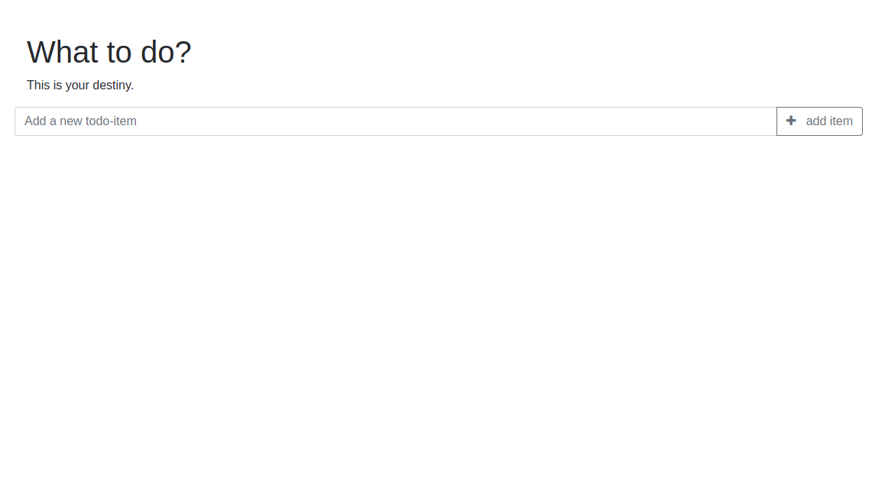

## ToDo Application with local storage :rocket:

This is a small application with react.js. 

<p align="center"> 

</p>

## Tjek this :poop: out! 

Try it out live [here](https://react.web-developer-js.de/) :smiley:


## Project Info

This projct uses [bootstrap](https://getbootstrap.com) and [fontawsome](https://fontawesome.com/), saving the todos in localstorage with a ***uuid***.

## Local Version

If you have cloned the repository please run:

```
yarn && yarn start
```
Have fun! :mouse:
